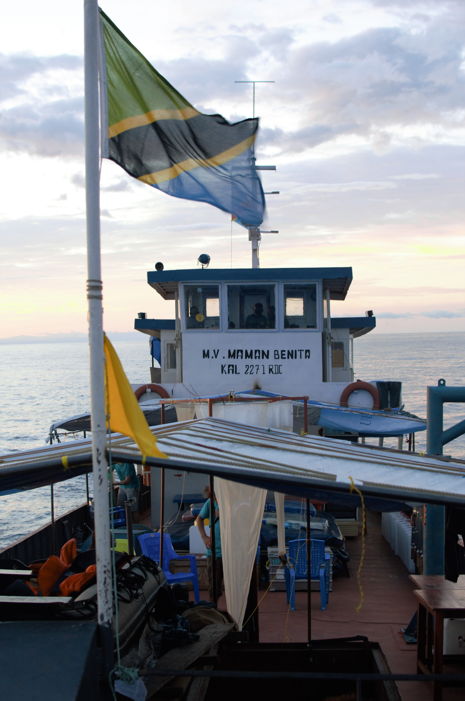
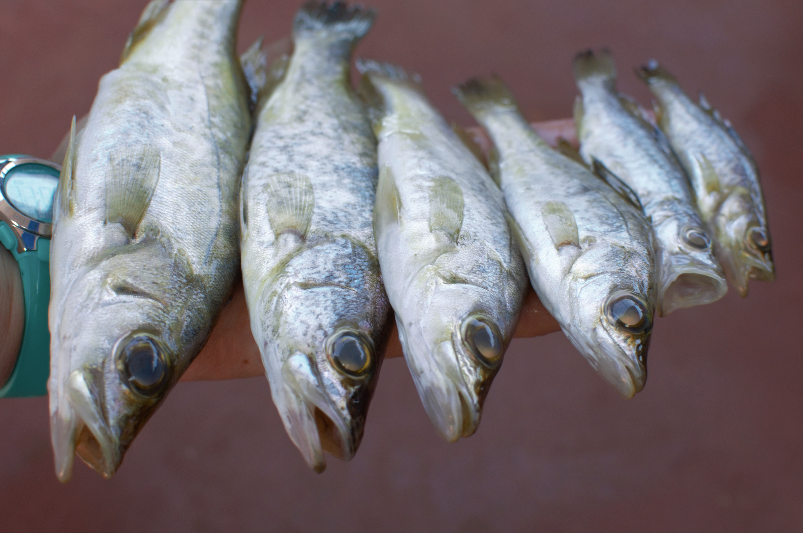

Home | [CV](cv/cv.html) | [Publications](publications/pubs.html) | [Research](research/research.html) | [Teaching](teaching/teaching.html) | [Resources](software/tools.html) | [Projects](projects/projects.html)

# Jessica A. Rick
## PhD Candidate, [C.E. Wagner Lab](http://www.cewagnerlab.com)   Program in Ecology & Dept of Botany   University of Wyoming

I have a broad interest in investigating how environmental change drives evolution at the population and species level, and in combining genomic and ecological techniques to connect processes at the population level to macroevolutionary patterns. Variation in climatic conditions in space and time is a key driver of speciation and patterns of biodiversity. However, the links between local or regional environmental conditions and resulting patterns in species richness are currently poorly understood—theory predicts more variable climates to lead to diversification in some cases and species extinction or collapse in others, while directional shifts in climate can also lead to either diversification via ecological opportunity or species extinction by their inability to adapt. A population’s ability to evolve and adapt is essential to survival in a changing environment, and I believe that understanding these links between the environment and evolution will be critical for maintaining biodiversity in the coming decades.

</img> 
</img> 
</img>

 

Contact me:  
Jessica Rick  
[jrick [at] uwyo.edu](mailto:jrick@uwyo.edu)

