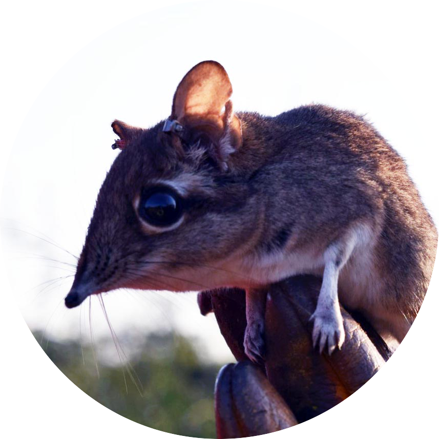
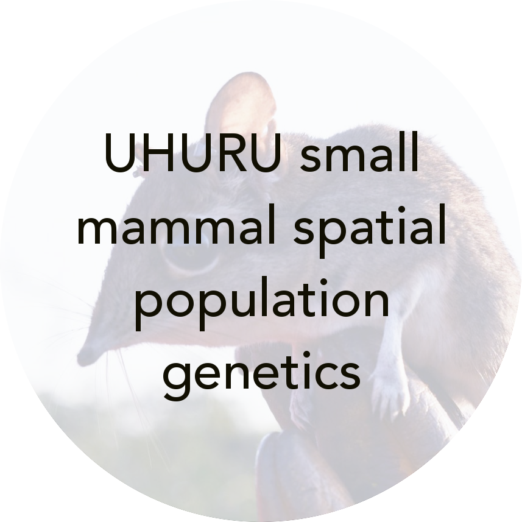
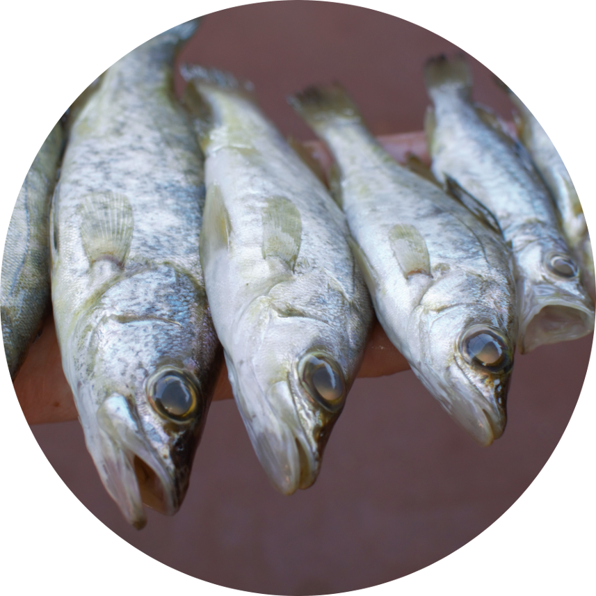
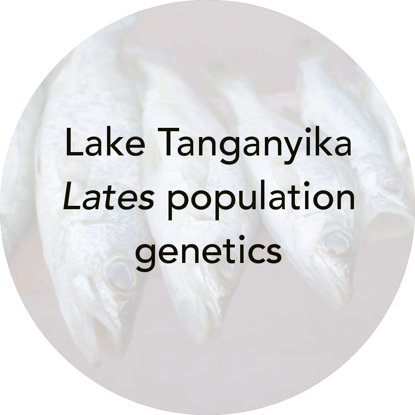
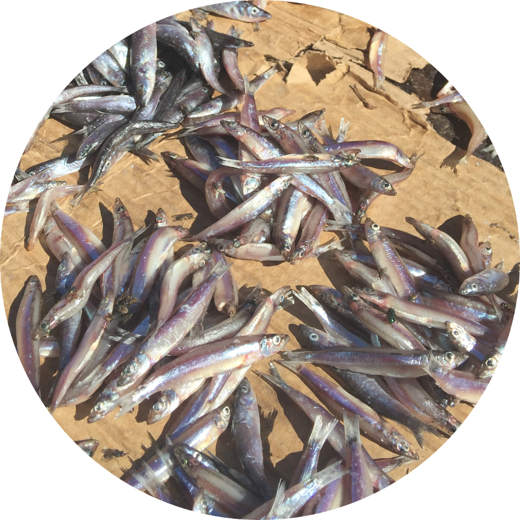
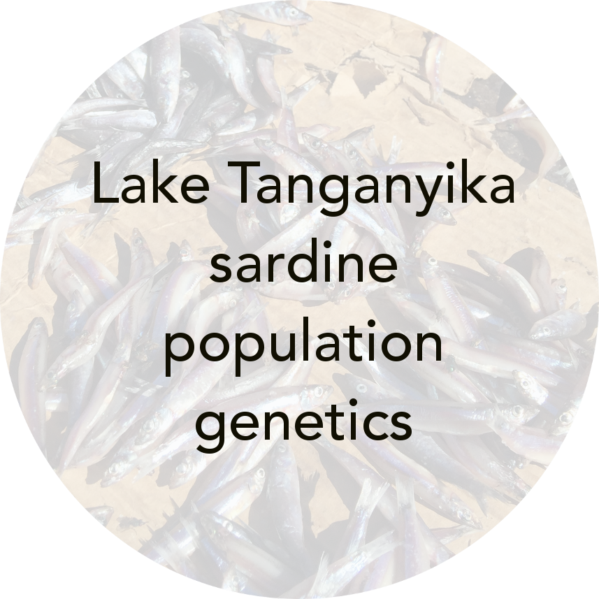

[Home](https://jessicarick.github.io/testweb) | [CV](../cv/cv.html) | [Publications](../publications/pubs.html) | [Research](../research/research.html) | [Teaching](../teaching/teaching.html) | [Resources](../software/tools.html) | [Projects](../projects/projects.html)

# Ongoing projects

## Dissertation projects
- [Lake Tanganyika *Lates* admixture and historical demography](lates-admix.html)
- [Reference bias in SNP-based population genetics](refbias.html)

## Side projects and collaborations
<centering>

  
  

  
  

  
  

