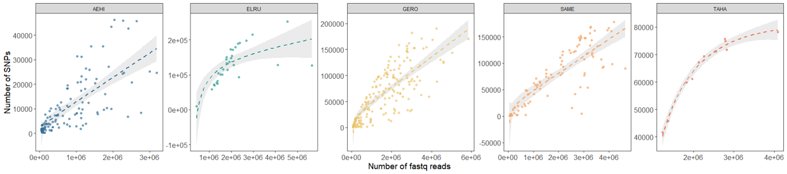
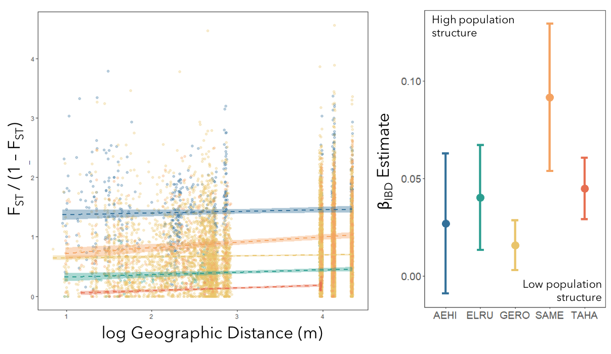
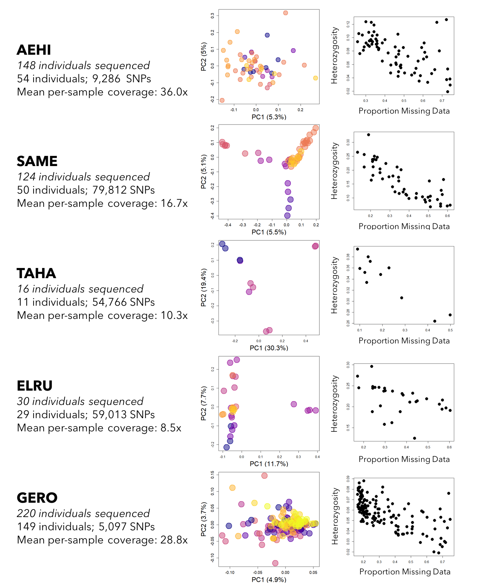

[Home](https://jessicarick.github.io/testweb) | [CV](../cv/cv.html) | [Publications](../publications/pubs.html) | [Research](../research/research.html) | [Teaching](../teaching/teaching.html) | [Software](../software/tools.html) | [Projects](../projects/projects.html)

# UHURU Small Mammal Genetics

Through a combination of diet diversity analysis, abundance and occupancy estimates, and genetic estimates of population structure, we are working to test hypotheses from Hanski and Brown about rarity. Briefly, Hanski ([1985](https://doi.org/10.2307/1940383)) postulates that common/widespread species are common because they are good dispersers, and can therefore rescue populations after they are extirpated. Brown ([1984](https://doi.org/10.1086/284267)), on the other hand, hypothesizes that common/widespread species are common because they are resource generalists, and such generalization promotes high in-situ reproduction. We are testing these differing hypotheses using data from five species co-existing at Mpala Research Centre, Kenya ([https://mpala.org/](https://mpala.org/)): *Taterillus harringtoni, Gerbilliscus robustus, Aethomys hindei, Saccostomus mearnsi, Elephantulus rufescens*.

## Goals for the genetics portion

We are using the genetic data to produce an estimate of connectivity and migration rates between populations, as a metric of dispersal in each of the species.

## Current results

</img> 

</img> 

</img> 

	
## Log of methods

 [Click here for project log](../projects/smammals-log.html) 
