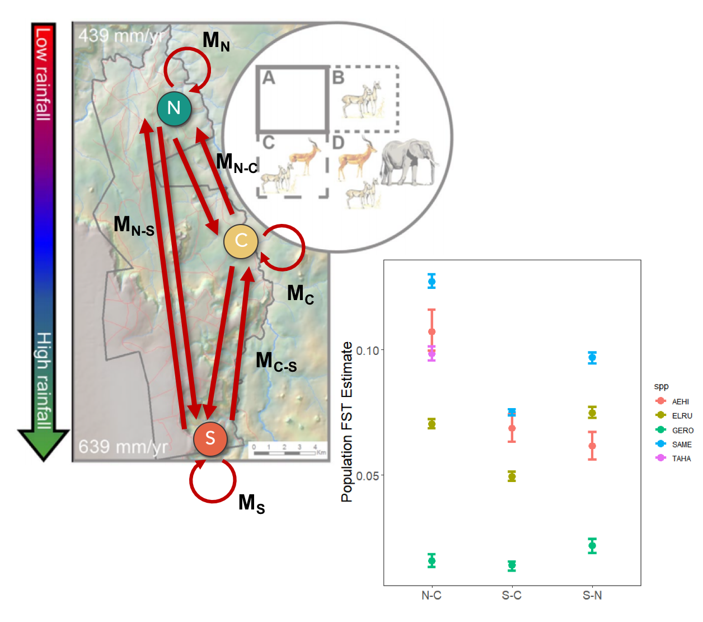

[Home](https://jessicarick.github.io/testweb) | [CV](../cv/cv.html) | [Publications](../publications/pubs.html) | [Research](../research/research.html) | [Teaching](../teaching/teaching.html) | [Resources](../software/tools.html) | [Projects](../projects/projects.html)

# UHURU Small Mammal Genetics

Through a combination of diet diversity analysis, abundance and occupancy estimates, and genetic estimates of population structure, we are working to test hypotheses from Hanski and Brown about rarity. Briefly, Hanski ([1985](https://doi.org/10.2307/1940383)) postulates that common/widespread species are common because they are good dispersers, and can therefore rescue populations after they are extirpated. Brown ([1984](https://doi.org/10.1086/284267)), on the other hand, hypothesizes that common/widespread species are common because they are resource generalists, and such generalization promotes high in-situ reproduction. We are testing these differing hypotheses using data from five species co-existing at Mpala Research Centre, Kenya ([https://mpala.org/](https://mpala.org/)): *Taterillus harringtoni, Gerbilliscus robustus, Aethomys hindei, Saccostomus mearnsi, Elephantulus rufescens*.

## Goals for the genetics portion

We are using the genetic data to produce an estimate of connectivity and migration rates between populations, as a metric of dispersal in each of the species.

## Current results

We received the sequences from our second round of sequencing (three lanes/genetic libraries) on 7/30/20 and combined these with the sequences from the first round of sequencing (also three lanes/genetic libraries). In total, we had 1,475,927,127 raw sequencing reads, split pretty much evenly among the 6 libraries. Once these were allocated to the individuals that they came from, this resulted in an average of 1,397,346 sequencing reads across the 784 individuals who were sequenced. Individuals with fewer than 50,000 reads (60 individuals) were omitted from further analyses due to insufficient coverage.

I assembled and analyzed the data in a similar manner to previous analyses, using the Stacks 2 de novo program and pipeline. In the figures below, I have plotted the number of sequencing reads vs. the number of SNPs called for each individual. Ideally, these plots would have a nice plateau (similar to a saturation curve)– we see this clearly in ELRU and TAHA, and somewhat in the others, but not as distinctly.

</img> 

From there, I filtered the variant sites (SNPs), and did a couple of preliminary analyses with those data. Below, I have plotted isolation-by-distance plots for each of the five species– on the left, I have plotted geographic distance vs genetic distance, and the slopes of these lines are plotted on the right. These slopes show how quickly genetic distance increases, and thus a larger βIBD value indicates greater population structure. As before, the relative magnitudes of these slopes seem to fit expectations based on the species’ biology.

</img> 

</img> 

</img> 

	
## Log of methods

 [Click here for project log](../projects/smammals-log.html) 
